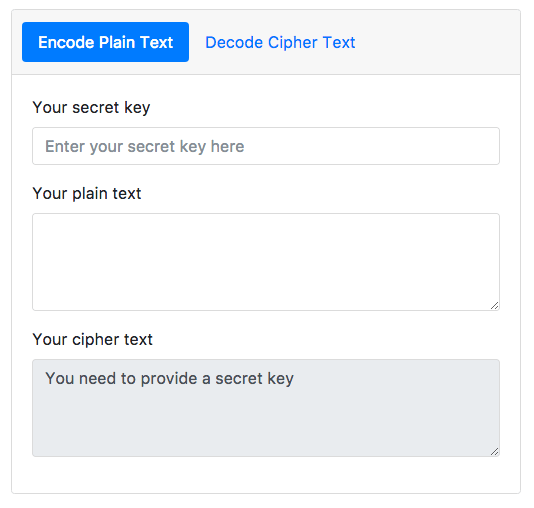

# Vigenère App

> A Vigenère encode/decode app written in Vue.js

This website uses Vue.js to create an experience that allows users to encrypt and decrypt text using the Vigenère cipher.



An instance of this application is running here: <https://vigenere-app.surge.sh>

## Build Setup

``` bash
# install dependencies
npm install

# serve with hot reload at localhost:8080
npm run dev

# build for production with minification
npm run build

# build for production and view the bundle analyzer report
npm run build --report

# run unit tests
npm run unit

# run e2e tests
npm run e2e

# run all tests
npm test

# deploy to surge.sh
npm run deploy
```
